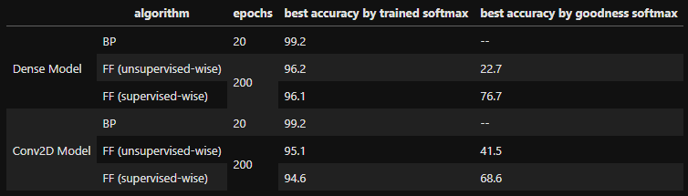

### Forward Forward algorithm in Tensorflow (Developing)

Paper: [Geoffrey Hinton. The Forward-Forward Algorithm: Some Preliminary Investigations](https://www.cs.toronto.edu/~hinton/FFA13.pdf)

### 0. Background
1. Implemented examples of supervised-wise forward forward (FF) algorithm (paper section 3.2) and unsupervised FF (section 3.3) based on my understanding.

2. In backprop (BP) algorithm, we do a forward pass through all layers during which it remembers many intermediate computed results that will be used in the backward pass to update the layers' weights. In FF, we do two forward passes on all **hidden layers**, one with positive data and one with negative data. In the postiive pass, after the data passes through a hidden layer, the layer will perform a gradient descent with the objective of minimizing the Binary crossentropy loss of a goodnessfunction. Each samples are assumed positive (`y_true=1`), and the activities of the layer is aggregated to produce a single goodness value as the `y_pred`. After the positve samples passes through all the layers, comes the negative pass. Like in the positive pass, each layer will perform a separate gradient descent on the negative data except that all samples assume (`y_pred=0`). A softmax Dense layer can be appened to the model at its building, only that it does not perform FF training, instead it performs the regular gradient descent on only the positive samples with the samples' original labels.

3. The objective that each layer is optimzied for is that the goodness for the positive samples is to be close to 1, and that for the negative samples to 0. A goodness function suggested in the paper is the sum of squared activity values minus threshold. The same goodness function is implemented

4. Used MNIST data (60000 training samples + 10000 test samples). Instead of predicting for 10 different digits, this repo predicts only 5 (number zero to four). The numbers five to nine are reserved as negative samples. This is not how the paper did it, instead the paper used all digits as positive, and created negatives by image augmentation.

5. In my implementation, each trainable layer has its own metrics function, loss function and optimizer.

6. [**IMPORTANT**] In principle, with FF algorithm, we can save a lot of memory because we don't need to remember anything outside of a layer to update the weights in that layer. However, memory saving is NOT my interest about this algorithm, but how it works and what it can do. Therefore, my implementation does NOT realize that memory saving capability. I am using gradient tape over the whole model, so it saves as many things as backprop algorithm will do. However, I do NOT use anything from other layers to update a layer. In short, gradients of other layers are there, but I do not use them. This is FF, but this is not the ultimate, memory-saving version of FF. 

### 1. Unsupervised-wise VS. supervised-wise FF

In a supervised-wise FF training, the label of a digit is one-hot-encoded (e.g. `[0., 0., 1., 0., 0.]` stands for label `2`) and overlayed in the first 5 pixels of the image. At prediction, 2 approaches are possible and implemented: (1) overlay a "default" (`[0.2, 0.2, 0.2, 0.2, 0.2]`), and see which label is predicted in the softmax layer, or (2) copy an image 5 times and in each overlay a different one-hot-encoded label, then pass all 5 of them to the model and look at which one has the highest accumulated goodness value.

In an unsupervised-wise training, the image is unchanged, and we rely on the softmax layer for class prediction.

### 2. Model description

Each hidden layer is trained with the FF algorithm. The normalized activities are concatenated and fed to a trainable Softmax Dense layer. The unnormalized activities are concatenated and on which the untrainable goodness function is applied. 

### 3. Results 

Source: examples.ipynb

- It's consistent with the paper that BP (Backprop) does better than FF (Forward-forward) even in less epochs.
- It's reasonable that the "accuracy by goodness softmax" is very poor with "unsupervised" data, however, it's interesting that it can reach 41.5% as well
- "Accuracy by goodness softmax" is pretty sensitive to initialization
- No hyperparameters tuned for best performing models. They are just for demo.
- Known major difference between this and the paper's implementation is that my layers are smaller and my training sets are smaller.
- Refer to examples.ipynb for the performance curves on the validation set.

