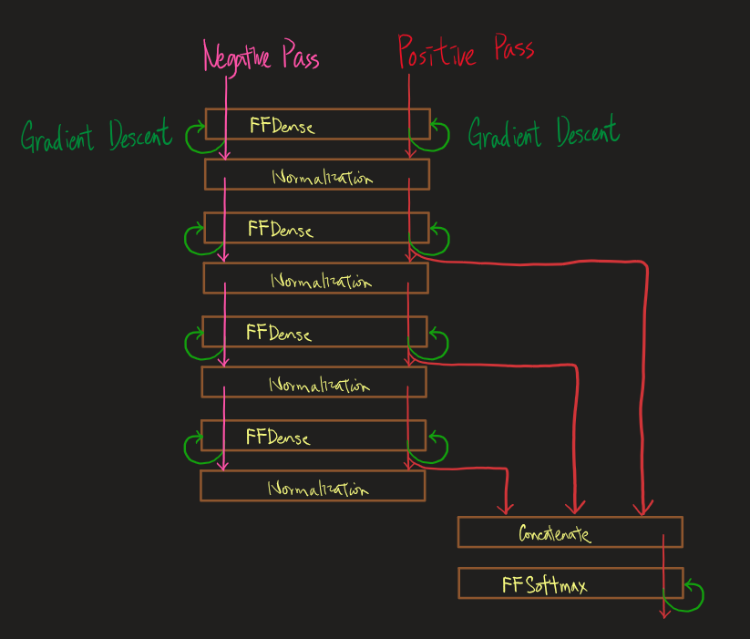

# Forward Forward algorithm in Tensorflow (Developing)

Paper: [Geoffrey Hinton. The Forward-Forward Algorithm: Some Preliminary Investigations](https://www.cs.toronto.edu/~hinton/FFA13.pdf)

## Give up thinking it as a Model
I have rethought and concluded that building FF-based layers into a Model is not flexible enough for researching new ideas. Therefore, I gave up the concept of Model that I had adopted in my [last implementation](https://github.com/rmwkwok/forward_forward_algorithm/tree/main/old_model_based_implementation), and re-implemented this work which only has FFLayers (but no FFModel). A FFLayer (e.g. `FFDense`) class is defined by inheriting the `BaseFFLayer` and the corresponding Tensorflow Layer (e.g. `Dense`). 

## The BaseFFLayer class
The `BaseFFLayer` enables a created FFLayer to perform 5 tasks: 

1. `TASK_TRANSFORM`. Perform the tensorflow layer's transformation;
2. `TASK_TRAIN_POS`. Positive pass training;
3. `TASK_TRAIN_NEG`. Negative pass training;
4. `TASK_EVAL`. Evaluation;
5. `TASK_EVAL_DUPED`. Evaluation specialized for supervised-wise FF's goodness layer.

## The TrainMgr class, and an example for unsuperwised-FF training
Since there is no Model, a `TrainMgr` is built to template the training loops and carry out metrics monitoring. It accepts a `dict` of layers and a training sequence function that connects the layers. For example, the following describes an unsupervised-wise FF based sequence:

``` python
layers = dict(
    # Utilities
    input = tf.keras.layers.InputLayer(name='input'),
    concat = tf.keras.layers.Concatenate(name='concat'),
    flatten = tf.keras.layers.Flatten(name='flatten'),
    preNorm = FFPreNorm(name='preNorm'),

    # FF layers
    b1 = FFDense(units=units, optimizer=Adam(0.0001), th_pos=.1, th_neg=.1, name=f'b1'),
    b2 = FFDense(units=units, optimizer=Adam(0.0001), th_pos=.1, th_neg=.1, name=f'b2'),
    b3 = FFDense(units=units, optimizer=Adam(0.0001), th_pos=.1, th_neg=.1, name=f'b3'),
    b4 = FFDense(units=units, optimizer=Adam(0.0001), th_pos=.1, th_neg=.1, name=f'b4'),

    # Classifiers
    softmax = FFSoftmax(units=NUM_CLASS, optimizer=Adam(0.001), name=f'softmax'),
)

def train_seq(X, y, y_ff):
    x = layers['input'](X)
    x = layers['flatten'](x)
    b1a = layers['b1'].ff_do_task(x, y_ff)
    b1n = layers['preNorm'](b1a)
    b2a = layers['b2'].ff_do_task(b1n, y_ff)
    b2n = layers['preNorm'](b2a)
    b3a = layers['b3'].ff_do_task(b2n, y_ff)
    b3n = layers['preNorm'](b3a)
    b4a = layers['b4'].ff_do_task(b3n, y_ff)
    b4n = layers['preNorm'](b4a)
    softmax_x = layers['concat']([b2n, b3n, b4n])
    y_pred = layers['softmax'].ff_do_task(softmax_x, y)
```

Pictorically:



## How FF training works

In each epoch, for unsupervised-FF training, 3 datasets pass through the sequence. 
1. First comes the positive data. After an positive mini-batch passes through the first `FFDense`, a gradient descent is done to update that `FFDense`. The transformed mini-batch then passes through the next `FFDense`, and another gradient descent is done to update the second `FFDense`, and the same sequence of operations are done for the other `FFDense`'s and the `FFSoftmax`. 
2. Then comes the negative pass which goes through only all the `FFDense` layers and performs gradient descent on them.
3. Last comes an evaluation dataset of only positive data. 

The 3 datasets each requires the layers to perform a different set of tasks (among the 5 listed above). Therefore, 3 different tensorflow graphs can be built based on a `train_seq` python function as demonstrated above. To avoid graph retracing, the `TrainMgr` is responsible for storing built Graphs so that they can be reused from epoch to epoch.  

## Unsupervised-wise FF vs. Supervised-wise FF

My understanding is that an unsupervised-wise-FF-trained layer does not use any label information, whereas an  supervised-wise-FF-trained layer uses it. Although the softmax that is appended as the last step of the unsupervised-wise FF algorithm uses the labels, it is not trained FF-wise, so the algorithm is still counted as unsupervised-wise-FF-trained.

## Supervised-wise FF flow chart


An extra `FFOverlay` layer is added to the top of the sequence which will overlays on the sample its one-hot encoded label. At evaluation (`TASK_EVAL_DUPED`), the `FFOverlay` will replicate a sample to 5 copies which will each have one of the 5 one-hot encoded labels.

An `FFGoodness` replaces the `FFSoftmax` to receive some `FFDense`'s outputs for computing goodness score.

## The goodness formula


Although this formula was used by the paper as an example for positive data, I used the same also for negative data.

## Result 2 (Updated on 26 Feb 2023)
### The data

This time, all digits were used as positive data, instead of just five of them in Result 1. However, unlike the paper (again), I didn't use hybrid digits as negative data for unsupervised-wise FF. Instead, I split the digits into two sets (A & B), and divide a layer into two halves. The first half took set A as positive data and set B sa negative, whereas the second half did the opposite. Three digit splitting were explored, including (for both supervised and unsupervised-wise FF) "random splitting", "same splitting", and (only for supervised-wise FF) "no splitting".

### Benchmark and summary

1. unsupervised-wise FF:
    - 97.1% @ `units = 2000` and Random splitting

2. supervised-wise FF:
    - 94.7% @ `units = 2000` and Random splitting
    - 95.1% @ `units = 2000` and No splitting

(No hyperparameter tuning were done)
    
For more explanations and discussions, refer to this article.

## Result 1 (Updated on 14 Feb 2023)
### The data

Unlike the paper, I used digits 0, 1, 2, 3, and 4 from the MNIST dataset as the positive-pass's data, and the rest of the digits as the negative-pass's. At training, both positive and negative pass data are used. At evaluation, only a separate set of positive-pass data is done.

### Benchmark and summary

The basic supervised and unsupervised results use the following settings:

1. `units = 100` (number of units in each hidden layer)
2. `batch_size = 128`
3. data shuffling enabled
4. train all layers in every epoch
5. epochs = 200

Their validation accuracies are:

1. unsupervised-wise FF: 
    - 96.64% @ basic setting
    - 98.44% @ changing to `units = 500` and `batch_size = 512`
    - 99.06% @ changing to `units = 2000` and `batch_size = 512`
2. supervised-wise FF:
    - 76.41% @ basic setting
    - 95.76% @ changing to `units = 500` and `batch_size = 512`
    - 97.42% @ changing to `units = 2000` and `batch_size = 512`

A similar setting with backprop can reach over 99% easily within 20 epochs.

For other results, observations, validation curves, and the layers' details, refer to examples/five_digits_as_positive/main.ipynb.


